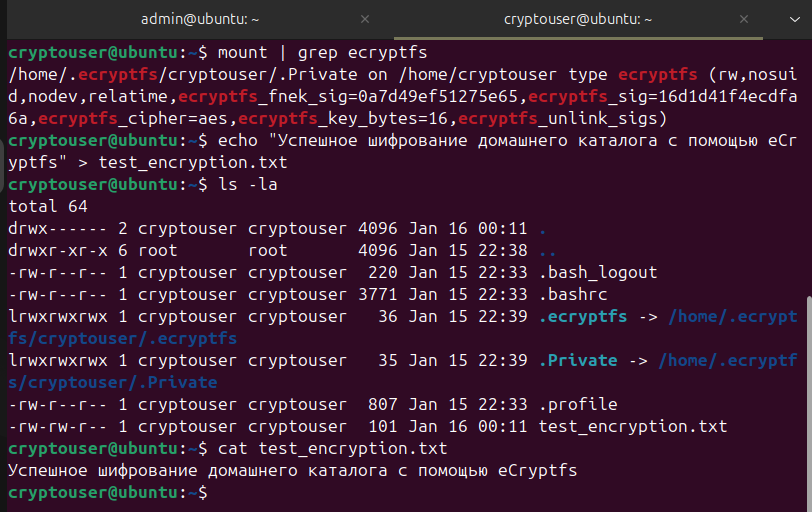
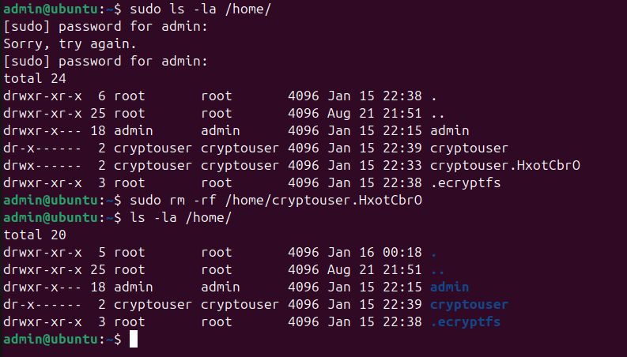

# Домашнее задание к занятию "4.1. Шифрование" - Овсянников Сергей

**Примечание:** 
- Задание 1 полностью выполнено в Ubuntu 22.04 (VirtualBox)
- Задание 2 выполнено в WSL2

* * *

### Задание 1

**Цель:** Установить eCryptfs, добавить пользователя cryptouser и зашифровать его домашний каталог.

**Выполнение в Ubuntu VirtualBox:**
1. ✅ Установлен пакет `ecryptfs-utils`
2. ✅ Создан пользователь `cryptouser`
3. ✅ Домашний каталог зашифрован командой `ecryptfs-migrate-home`
4. ✅ Проверена работа зашифрованного каталога
5. ✅ Mount passphrase записан и сохранен
6. ✅ Backup удален после успешной проверки

**Скриншоты выполнения:**

* * *

### Задание 2

**Цель:** Установить поддержку LUKS, создать зашифрованный раздел (контейнер).

**Выполнение в WSL2:**
1. ✅ Установлен пакет `cryptsetup`
2. ✅ Создан файл-контейнер `luks_container.img` размером 100 Мб
3. ✅ Контейнер зашифрован с использованием LUKS
4. ✅ На зашифрованном устройстве создана файловая система ext4
5. ✅ Протестирована запись и чтение файлов
6. ✅ Контейнер демонтирован и закрыт

**Скриншоты выполнения:**

* * *

## Итоги и выводы

1. **eCryptfs успешно работает** в полноценном Linux (Ubuntu VirtualBox)
   - Домашний каталог пользователя зашифрован
   - Прозрачное шифрование/дешифрование работает корректно
   - Mount passphrase сохранен для восстановления

2. **LUKS полностью поддерживается** в WSL2
   - Все операции с LUKS работают корректно
   - Можно создавать, шифровать и монтировать контейнеры

3. **Выполнены все учебные цели:**
   - Освоены принципы шифрования на уровне файловой системы (eCryptfs)
   - Освоены принципы шифрования на уровне блочных устройств (LUKS)
   - Изучены ограничения разных сред выполнения

4. **Ключевое отличие технологий:**
   - eCryptfs: шифрование на уровне файлов/каталогов
   - LUKS: шифрование целых разделов/устройств

* * *
