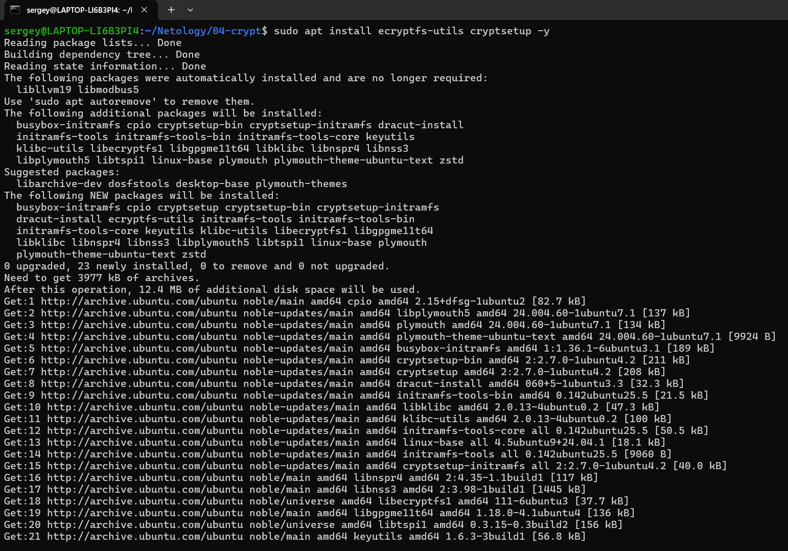
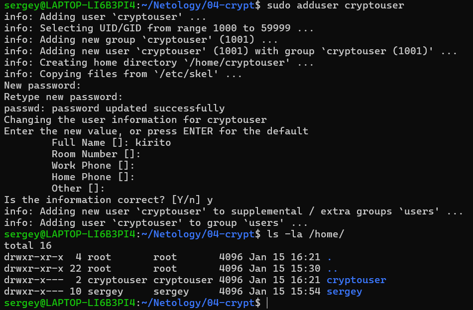
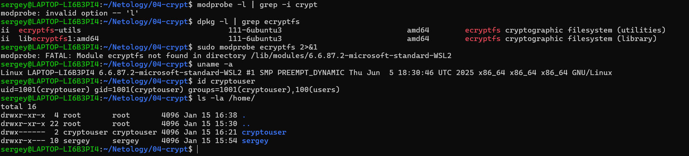
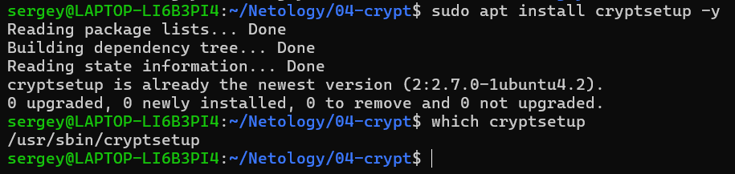
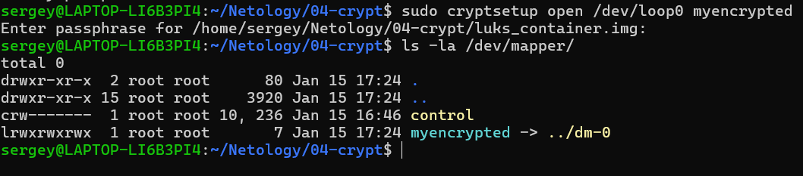
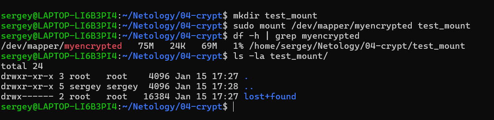
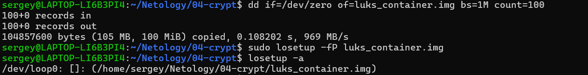

# Домашнее задание к занятию "`Защита хоста`" - `Овсянников Сергей`


### Инструкция по выполнению домашнего задания

   1. Сделайте `fork` данного репозитория к себе в Github и переименуйте его по названию или номеру занятия, например, https://github.com/имя-вашего-репози>
   2. Выполните клонирование данного репозитория к себе на ПК с помощью команды `git clone`.
   3. Выполните домашнее задание и заполните у себя локально этот файл README.md:
      - впишите вверху название занятия и вашу фамилию и имя
      - в каждом задании добавьте решение в требуемом виде (текст/код/скриншоты/ссылка)
      - для корректного добавления скриншотов воспользуйтесь [инструкцией "Как вставить скриншот в шаблон с решением](https://github.com/netology-code/sys->
      - при оформлении используйте возможности языка разметки md (коротко об этом можно посмотреть в [инструкции  по MarkDown](https://github.com/netology->
   4. После завершения работы над домашним заданием сделайте коммит (`git commit -m "comment"`) и отправьте его на Github (`git push origin`);
   5. Для проверки домашнего задания преподавателем в личном кабинете прикрепите и отправьте ссылку на решение в виде md-файла в вашем Github.
   6. Любые вопросы по выполнению заданий спрашивайте в чате учебной группы и/или в разделе “Вопросы по заданию” в личном кабинете.

Желаем успехов в выполнении домашнего задания!

### Дополнительные материалы, которые могут быть полезны для выполнения задания

1. [Руководство по оформлению Markdown файлов](https://gist.github.com/Jekins/2bf2d0638163f1294637#Code)

---

### Задание 1

1. Установка eCryptfs и создание пользователя cryptouser:

     * Установлены пакеты: `ecryptfs-utils` и `cryptsetup`
     * Создан пользователь: `cryptouser` с UID 1001
     * Обнаружено ограничение WSL2: модуль ядра `ecryptfs` отсутствует
       - Команда `sudo modprobe ecryptfs` возвращает ошибку: `Module ecryptfs not found in directory /lib/modules/6.6.87.2-microsoft-standard-WSL2`
       - Проверка `uname -a` показывает: `Linux LAPTOP-LI6B3PI4 6.6.87.2-microsoft-standard-WSL2`

  2. **Что должно было быть выполнено дальше (если бы работало в полноценном Linux):**

```bash
# 1. Шифрование домашнего каталога пользователя
sudo ecryptfs-migrate-home -u cryptouser

# 2. Ввод парольной фразы для eCryptfs (дважды)
# Будет запрошена passphrase для шифрования файлов

# 3. Выход из системы и вход под cryptouser для проверки
# (Нужно выйти из текущей сессии)
logout

# 4. Вход под пользователем cryptouser
su - cryptouser
# Ввести пароль пользователя cryptouser

# 5. Проверка зашифрованных данных
ls -la ~/
# Должны появиться файлы: Access-Your-Private-Data.desktop и README.txt

# 6. Проверка монтирования зашифрованного каталога
mount | grep ecryptfs
# Должно показать монтирование ecryptfs

# 7. После успешной проверки удаление незашифрованной копии
sudo rm -rf /home/.ecryptfs/cryptouser

  2. Скриншоты выполнения:





---

### Задание 2

  1. Установка поддержки LUKS и создание зашифрованного контейнера:

     * Установлен пакет: `cryptsetup` (уже установлен в задании 1)
     * Создан файл-контейнер: `luks_container.img` размером 100 Мб
     * Привязан к loop-устройству: `/dev/loop0`
     * Зашифрован с использованием LUKS с паролем
     * Создана файловая система: ext4 на зашифрованном устройстве
     * Протестирована запись и чтение файлов
     * Контейнер демонтирован и закрыт

  2. Скриншоты выполнения:






  3. Выполненные команды:

```bash
# Создание контейнера
dd if=/dev/zero of=luks_container.img bs=1M count=100

# Привязка к loop-устройству
sudo losetup -fP luks_container.img

# Шифрование LUKS
sudo cryptsetup luksFormat /dev/loop0

# Открытие контейнера
sudo cryptsetup open /dev/loop0 myencrypted

# Создание файловой системы
sudo mkfs.ext4 /dev/mapper/myencrypted

# Монтирование и тестирование
mkdir test_mount
sudo mount /dev/mapper/myencrypted test_mount
echo "Test file in LUKS" | sudo tee test_mount/test.txt

# Демонтирование и очистка
sudo umount test_mount
sudo cryptsetup close myencrypted
sudo losetup -d /dev/loop0
rmdir test_mount
